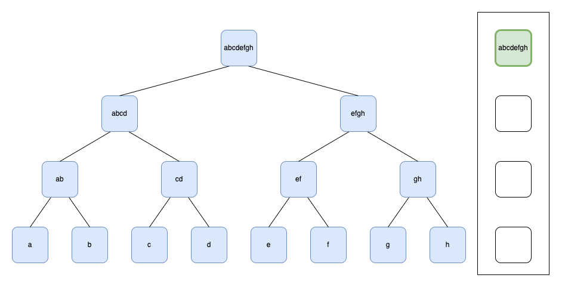
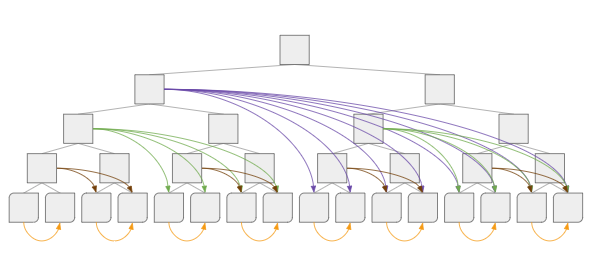

# merkle

**merkle** is a simple Go library for creating and verifying Merkle trees. It is designed to be easy to use, while
remaining efficient and secure.

## Usage

For usage examples and API documentation, see the [GoDoc](https://pkg.go.dev/github.com/fasmat/merkle?tab=doc).

## How It Works

### Tree Construction

The Merkle tree is constructed sequentially and stored in memory. The [`Tree.Add`](https://pkg.go.dev/github.com/fasmat/merkle#Tree.Add) method calculates the root incrementally and retains only the nodes that do not yet have a sibling. As a result, at most `O(log₂ n)` memory is used, where `n` is the number of leaves added to the tree.

The tree is built bottom-up: each node is derived from its children. The [`Tree.Root`](https://pkg.go.dev/github.com/fasmat/merkle#Tree.Root) method returns the root hash of the tree, padding with zero values to the right if a node lacks a sibling.

During construction only the parking nodes are retained (green in animation). Whenever a node is added that already has a sibling (i.e. parking node on that level) the nodes are hashed and a new parking node is created on a higher level, continuing the process until a level is reached that has no sibling.

In a balanced tree only the top level will have a parking node, that is returned as the root of the tree when the [`Tree.Root`](https://pkg.go.dev/github.com/fasmat/merkle#Tree.Root) method is called. In an unbalanced tree, parking nodes below the root receive zero values as siblings, and the root will be the hash of the last parking node.

### Proof Generation and Verification

You can generate a Merkle proof for one or more leaves using [`Builder.WithLeafToProve`](https://pkg.go.dev/github.com/fasmat/merkle#Builder.WithLeafToProve) or [`Builder.WithLeavesToProve`](https://pkg.go.dev/github.com/fasmat/merkle#Builder.WithLeavesToProve). The resulting proof is a list of hashes required to verify the inclusion of the specified leaves in the tree.

The proof is constructed by collecting the sibling hashes of nodes that cannot be derived solely from the proven leaves. These hashes are returned in the order necessary to verify the inclusion path back to the root, as produced by [`Tree.RootAndProof`](https://pkg.go.dev/github.com/fasmat/merkle#Tree.RootAndProof).

The proof can be verified using the [`ValidateProof`](https://pkg.go.dev/github.com/fasmat/merkle#ValidateProof) function.

### Custom Leaf Hashing and Proof of Sequential Work

The `merkle` package allows you to customize the leaf hashing by implementing the [`LeafHasher`](https://pkg.go.dev/github.com/fasmat/merkle#LeafHasher) interface. This is useful for applications that require specific hashing algorithms or want to preprocess leaf data before adding it to the tree.

An example implementation is the [`SequentialWorkHasher`](https://pkg.go.dev/github.com/fasmat/merkle#SequentialWorkHasher), which hashes each leaf together with all its left siblings. This creates a _proof of sequential work_, useful for applications where it is necessary to demonstrate that a certain amount of work has been performed.

Unlike traditional proof of work schemes, which involve solving cryptographic puzzles of variable difficulty, proof of sequential work relies on a deterministic and predictable amount of computation. Hashing each leaf with its left siblings ensures that the process cannot be parallelized and that early termination yields partial progress. This makes it an efficient way to prove that a series of steps were performed in order.

Verification of such a sequential proof of work is an interactive process: the verifier can request any leaf and its corresponding Merkle proof from the prover, then validate that the leaf is part of the tree. The more leaves the prover can produce with valid proofs, the higher the confidence the verifier has that the prover performed the full computation.

In a future release, the library will support persisting leaves and nodes to disk, enabling a more efficient proving/verification process even for large trees.
